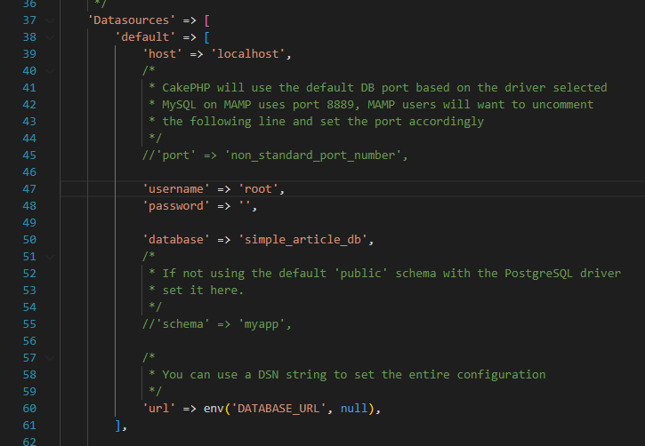
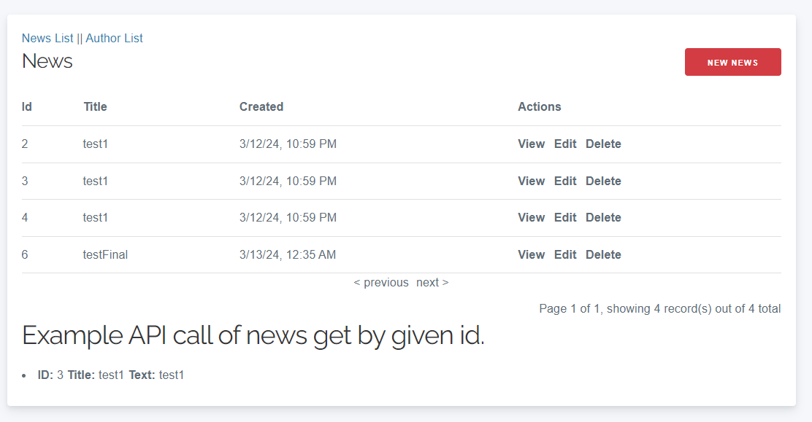
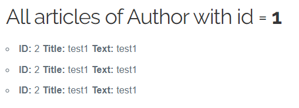
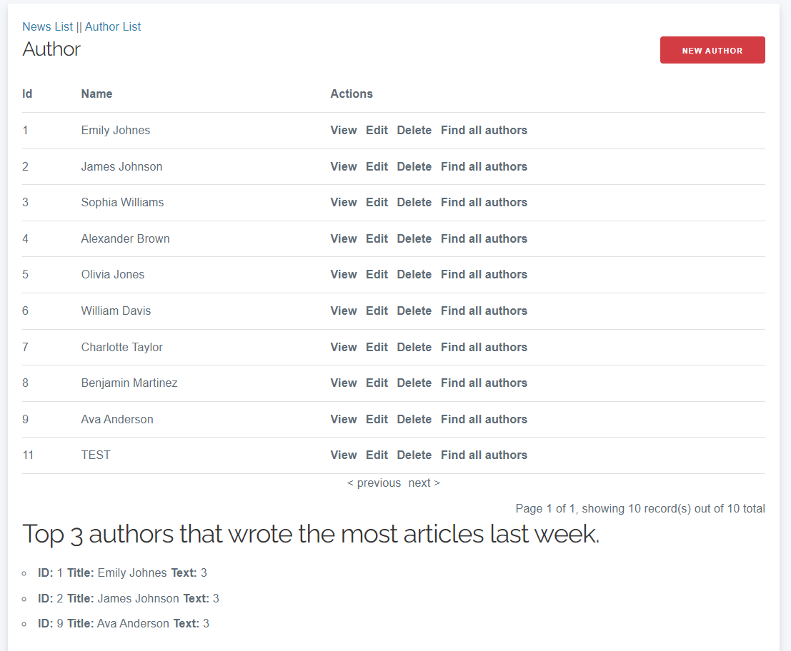

## To this recrutment task was used:
- Framework CakePHP in version 4.x;
- Jquery
- Wampserver for database purpouses;
- PHP version in Wampserver 8.2.13

## Installation

1. Download [Composer](https://getcomposer.org/doc/00-intro.md) or download it by direct link [Direct download link](https://getcomposer.org/Composer-Setup.exe).
2. After installation of composer install [WampServer](https://sourceforge.net/projects/wampserver/) and click download or alternative install [XAMPP](https://www.apachefriends.org/pl/index.html).
3. In my scenario #WampServer I need to install also [Visual Studio 2013 (VC++ 12.0)](https://learn.microsoft.com/en-us/cpp/windows/latest-supported-vc-redist?view=msvc-170#visual-studio-2013-vc-120) and [Visual Studio 2015, 2017, 2019, and 2022](https://learn.microsoft.com/en-us/cpp/windows/latest-supported-vc-redist?view=msvc-170#visual-studio-2015-2017-2019-and-2022).
4. After downloading source code/project put it in WampServer folder in WampServer www folder - my case <strong>C:\wamp64\www</strong> .
5. In project folder run command <strong>composer install</strong> that create all neccessary files.
6. At the end of executing of this command you will get info 'Set Folder Permissions?', <strong>press y</strong>.
7. Finally enter command <strong>bin/cake server</strong> and under given link your app will be running!

## Database Config

1. In <strong>config/app_local.php</strong> complete the lines of code same as in the attached picture:  
 
Username and password by default have given data(If do not changed in Wampserver config!).
2. Initial database operations are in file <strong>simple_article_db.sql</strong>(with example data) that is located in main root of the project.
3. When Wampserver is running you can enter into web browser this link [Localhost phpmyadmin](http://localhost/phpmyadmin/).
4. Database is called <strong>simple_article_db</strong> with collation <strong>utf8mb3_general_ci</strong>.
5. After creating the database, import the simple_article_db file.
6. Your database is ready!

## How to use it

1. In top left we can switch between News and Author view.
2. In the middle are listed items News or Author with possibility to manipulation (view, edit, delete).
3. Each one of view have button in top right for adding content.
4. In the News view, <strong>an API endpoint</strong> is called under the list of articles, which displays <strong>the retrieved article with the specified ID</strong> (if there are no articles, console.log that there is no article with the specified ID). 
  
5. In Author site by clicking in action section "Find all authors" will be called <strong>API endpoint</strong> that display under list of items <strong>all articles for given author ID.</strong> 
  
6. On Author site load is called <strong>API endpoint</strong> for displaying <strong>top 3 authors that wrote the most articles last week.</strong>  
 